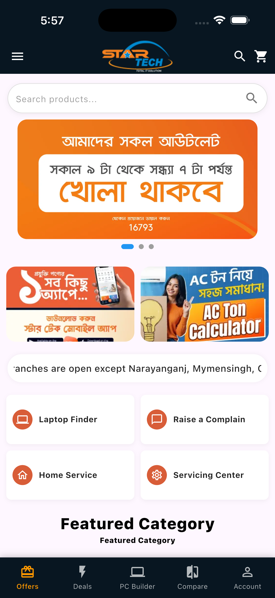
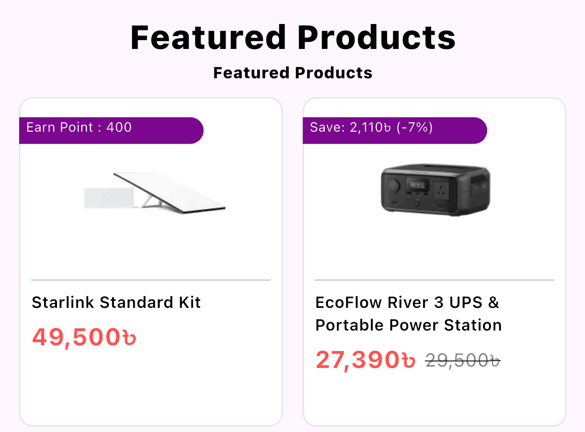
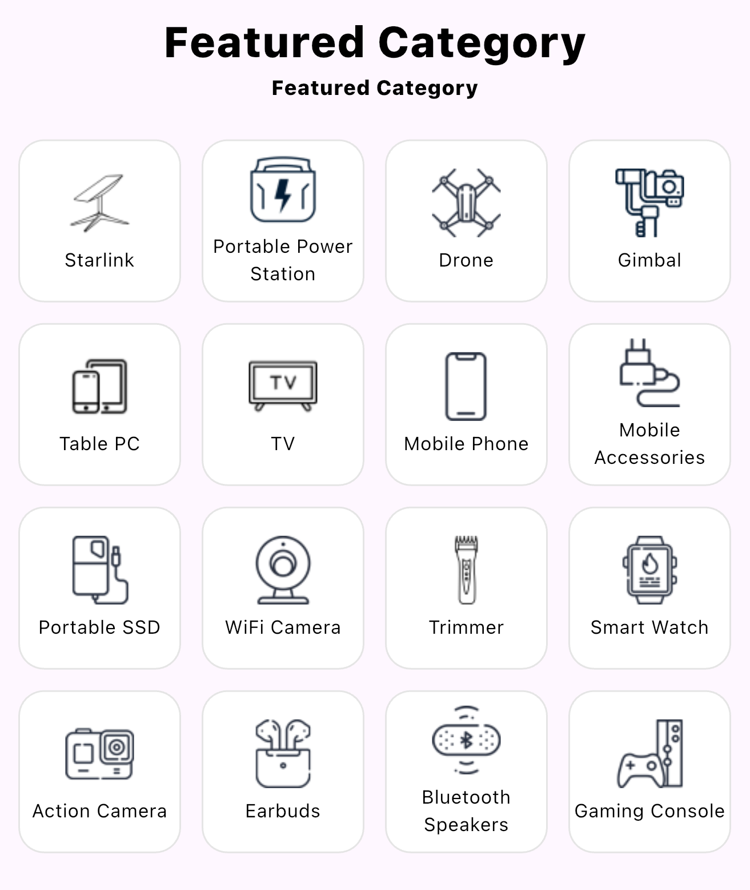

# 🛒 StarTech E-Commerce UI (Flutter)

A modern, responsive **Flutter-based e-commerce UI clone** inspired by StarTech.  
This project demonstrates real-world UI architecture, reusable widgets, GetX state management, and scalable product/category systems.

---

## 🚀 Features

### 🏠 Home Screen
- Animated banner slider (Carousel)
- Scrolling announcement text
- Promotional banners
- Services section grid
- Featured categories grid
- Featured products grid

### 🛍 Product System
- Discount price support
- Earn point system (conditional UI)
- Save money badge
- Dynamic product card rendering

### 📂 Category System
- Grid-based category layout (4 columns)
- Icon + title UI
- Responsive design for mobile

### 🎯 UI Components
- Custom search bar
- Animated slider indicator
- Reusable section title widget
- Service cards grid
- Bottom navigation bar

### ⚙ State Management
- GetX used for:
    - Carousel index tracking
    - Reactive UI updates

---

## 🧠 Tech Stack

- Flutter (UI Framework)
- Dart
- GetX (State Management)
- Carousel Slider
- Text Scroll package
- Network Images (API-ready structure)

---

## 📸 Screenshots

> Add your screenshots in `/assets/screenshots/`

| Home Screen | Featured Products | Categories |
|------------|------------------|------------|
|  |  |  |

---

## 📁 Project Structure
